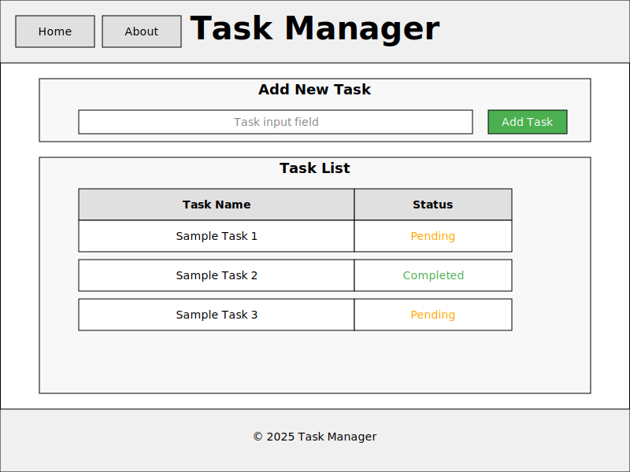
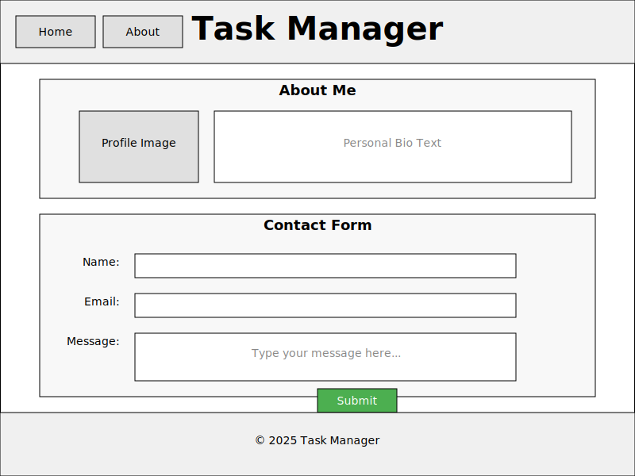

# My-Tasks

A simple task manager website where users can display their tasks, prioritize them, and check the status for each one.

## Wireframes

### Home Page Wireframe


The Home page includes:
- Header with navigation menu
- Task input section with text field and "Add Task" button
- Task table with Name and Status columns
- Footer with copyright information

### About Page Wireframe


The About page includes:
- Header with navigation menu
- Personal section with profile image and bio
- Contact form with Name, Email, and Message fields
- Footer with copyright information

## Project Structure

```
task-manager/
├── index.html
├── about.html
├── css/
│   └── styles.css
├── js/
│   └── app.js
└── README.md
```

## Features

- Add new tasks
- View task list with status
- Mark tasks as complete or in progress
- About page with contact form
- Responsive design for mobile and desktop

  
## 1. What observations or questions do you have about what you've learned so far?
This project was incredibly enjoyable for me, as I was able to create a website effectively for the first time. I have some questions about the footer because every time I resize the screen, it doesn’t stay in place. I also managed to use some JavaScript functions that I learned in the last two lectures, along with other operations that required me to rely on external sources, especially AI-supported websites. Visual Studio undoubtedly helped me complete the design automatically, and I then modified the code based on the wireframe I envisioned using VSG Repo.

## 2. How long did it take you to complete this assignment? And how long did you expect it to take?
Initially, I expected that creating a website with these requirements would be quick and take about two hours. However, I found that it took me the entire day for two main reasons: First, I wanted the site to be error-free, and second, my work environment wasn’t ideal, and I couldn’t dedicate all my time to it. Nevertheless, I’m really happy with the outcome, and I feel proud that I’ve built a simple and effective website. Next time, I’ll be able to manage my time better, work faster, and achieve even better performance.

##Click the link and watch it live
https://ghassan-omar.github.io/My-Tasks/
